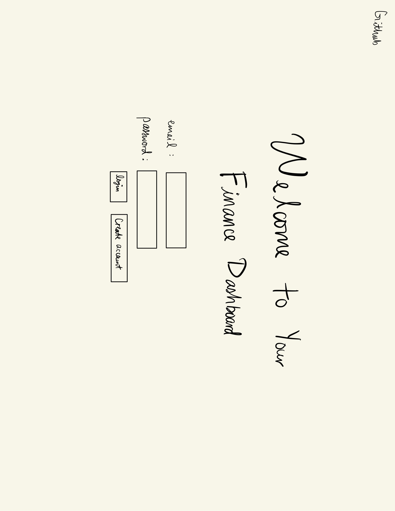
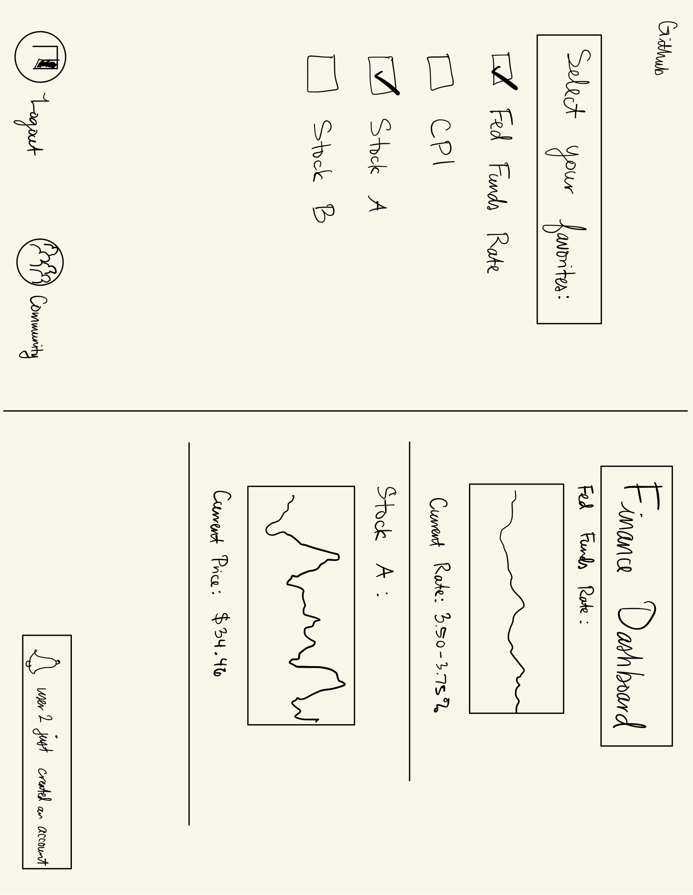
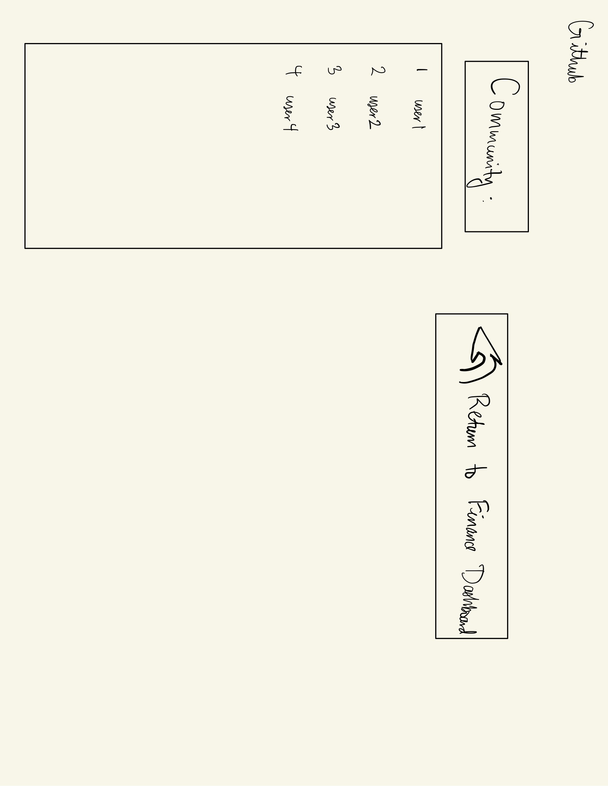

# Finance Dashboard

[My Notes](notes.md)

This application serves as a centralized dashboard for key financial metrics of interest to the user. Users can select from different options such as the price of a stock, the current federal funds rate, and the rate of inflation. Users will login, be able to customize which key indicators they would like to display, save their preferences, and receive notifications when another user logs in.

## 🚀 Specification Deliverable

For this deliverable I did the following. I checked the box `[x]` and added a description for things I completed.

- [x] Proper use of Markdown
- [x] A concise and compelling elevator pitch
- [x] Description of key features
- [x] Description of how you will use each technology
- [x] One or more rough sketches of your application. Images must be embedded in this file using Markdown image references.

### Elevator pitch

Ever made a goal to become more financially literate and more aware of how the economy is doing every day, but you end up quitting three days in because there's too much to keep track of? Look no further than this Finance Dashboard that enables you to centralize all of your favorite key indicators in one place and see updates in real time. Say goodbye to having to search each on individually and losing an entire morning every day—customize your very own dashboard today and impress your dad next time he calls with your always-in-the-know grasp on the economy!

### Design

### Key features

- Users can select which financial metrics they want to add to their dashboard
- Users can see other users that have also created an account
- Financial data will update in real time every few minutes (for metrics that vary within one day)
- User selections will be stored for next login

### Technologies

I am going to use the required technologies in the following ways.

- **HTML** - Uses correct HTML structure for application. Three HTML pages: login, dashboard, and community of users (may change to just two and exclude the community page as needed). Hyperlink to GitHub.
- **CSS** - Styling that looks professional and does not distract from conveying key information, including good color choices and clear delineations between financial metrics.
- **React** - Offers login for users, displays possible selections for financial metrics, displays metrics.
- **Service** - Backend service with endpoints for login, retrieving selections for APIs.
- **DB/Login** - Store users, store user selections in their dashboard, register and login users. Can't select dashboard items without authentication.
- **WebSocket** - As each user creates an account, other users are notified who made a new account.

## 🚀 AWS deliverable

For this deliverable I did the following. I checked the box `[x]` and added a description for things I completed.

- [x] **Server deployed and accessible with custom domain name** - [My server link](https://yourdomainnamehere.click).

## 🚀 HTML deliverable

For this deliverable I did the following. I checked the box `[x]` and added a description for things I completed.

- [x] **HTML pages** - I added three pages: index.html, dashboard.html, and community.html
- [x] **Proper HTML element usage** - Used various html tags such as header,footer, nav on each page, as well as body and main on each page. 
- [x] **Links** - I put links to each of my pages in the header of each page
- [x] **Text** - I added text to help welcome users and prompt them to login, to label the buttons they will be able to toggle on the dashboard page, and placeholder text for the database/Websocket connections on my community page
- [x] **3rd party API placeholder** - I put a placeholder for my 3rd party API placeholder on my dashboard page (where i'll connect with charts from other sites), I put a picture there for now.
- [x] **Images** - I added an image to my community page (line 26)
- [x] **Login placeholder** - in my index.html, I have the placeholder for my login (lines 29-40)
- [x] **DB data placeholder** - I put a database table placeholder for storing users and when they last logged on (community.html lines 39-60)
- [x] **WebSocket placeholder** - I added placeholder text for where I will put notifications for what metrics other users are choosing to track (displaying in their dashboard page). This is in community.html lines 25-36.

## 🚀 CSS deliverable

For this deliverable I did the following. I checked the box `[x]` and added a description for things I completed.

- [ ] **Header, footer, and main content body** - I did not complete this part of the deliverable.
- [ ] **Navigation elements** - I did not complete this part of the deliverable.
- [ ] **Responsive to window resizing** - I did not complete this part of the deliverable.
- [ ] **Application elements** - I did not complete this part of the deliverable.
- [ ] **Application text content** - I did not complete this part of the deliverable.
- [ ] **Application images** - I did not complete this part of the deliverable.

## 🚀 React part 1: Routing deliverable

For this deliverable I did the following. I checked the box `[x]` and added a description for things I completed.

- [ ] **Bundled using Vite** - I did not complete this part of the deliverable.
- [ ] **Components** - I did not complete this part of the deliverable.
- [ ] **Router** - I did not complete this part of the deliverable.

## 🚀 React part 2: Reactivity deliverable

For this deliverable I did the following. I checked the box `[x]` and added a description for things I completed.

- [ ] **All functionality implemented or mocked out** - I did not complete this part of the deliverable.
- [ ] **Hooks** - I did not complete this part of the deliverable.

## 🚀 Service deliverable

For this deliverable I did the following. I checked the box `[x]` and added a description for things I completed.

- [ ] **Node.js/Express HTTP service** - I did not complete this part of the deliverable.
- [ ] **Static middleware for frontend** - I did not complete this part of the deliverable.
- [ ] **Calls to third party endpoints** - I did not complete this part of the deliverable.
- [ ] **Backend service endpoints** - I did not complete this part of the deliverable.
- [ ] **Frontend calls service endpoints** - I did not complete this part of the deliverable.
- [ ] **Supports registration, login, logout, and restricted endpoint** - I did not complete this part of the deliverable.

## 🚀 DB deliverable

For this deliverable I did the following. I checked the box `[x]` and added a description for things I completed.

- [ ] **Stores data in MongoDB** - I did not complete this part of the deliverable.
- [ ] **Stores credentials in MongoDB** - I did not complete this part of the deliverable.

## 🚀 WebSocket deliverable

For this deliverable I did the following. I checked the box `[x]` and added a description for things I completed.

- [ ] **Backend listens for WebSocket connection** - I did not complete this part of the deliverable.
- [ ] **Frontend makes WebSocket connection** - I did not complete this part of the deliverable.
- [ ] **Data sent over WebSocket connection** - I did not complete this part of the deliverable.
- [ ] **WebSocket data displayed** - I did not complete this part of the deliverable.
- [ ] **Application is fully functional** - I did not complete this part of the deliverable.
